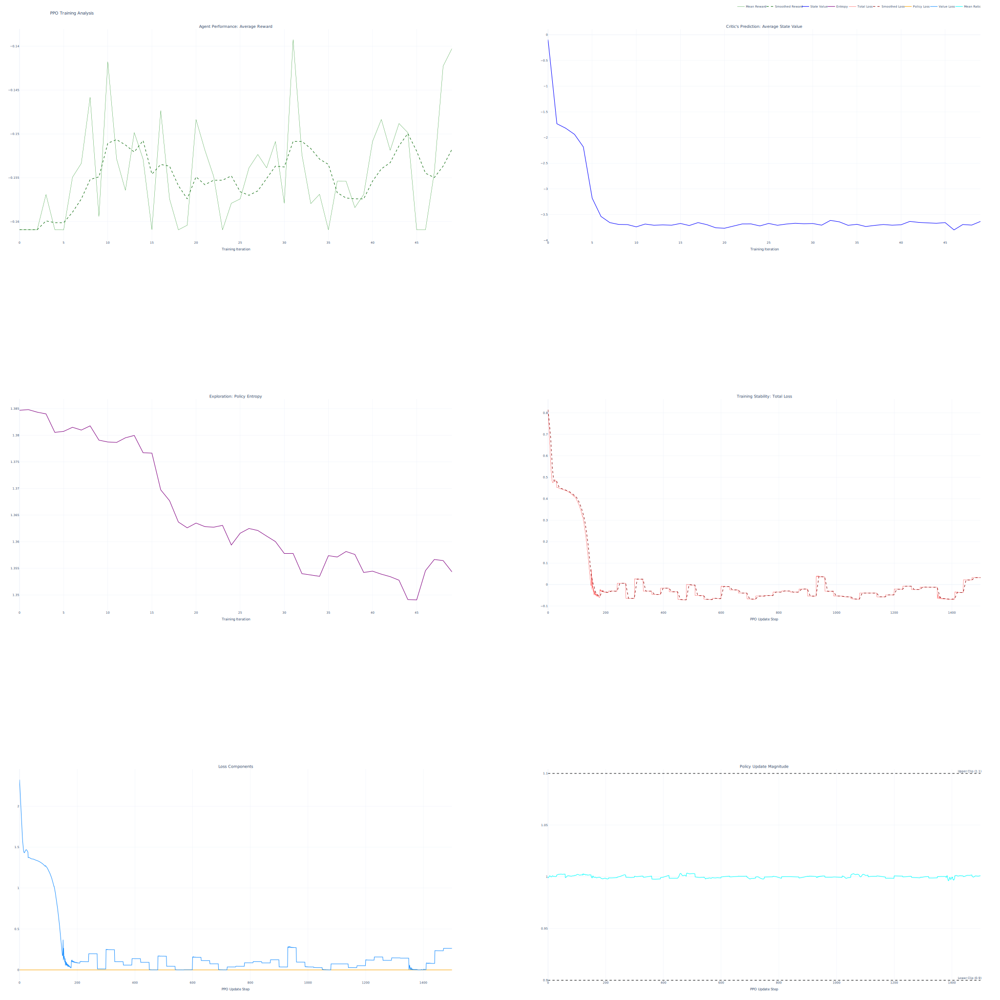

# 🤖 Reinforcement Learning Agent for 3D Terrain Navigation

This project presents the development and training of a reinforcement learning agent designed to navigate a procedurally generated 3D terrain. The agent learns to find multiple goals while efficiently managing its fuel supply. The implementation uses PyTorch and the **Proximal Policy Optimization (PPO)** algorithm.

This document details the project's architecture, the key decisions made during development, and instructions for setup and usage.

## Project Architecture and Decision Process

This project was built from the ground up, with several key design decisions made to create a robust and effective learning system.

### 1. The Environment (`terrain.py`)

The foundation of any RL project is the environment. The goal was to create a challenging, non-static world.


  * **Procedural Generation**: Instead of a fixed map, **Perlin noise** (`noise` library) is used to generate the terrain. This ensures the agent learns a general navigation strategy rather than memorizing a specific layout.
  * **State Representation**: The agent's "view" of the world is a **stack of 4x256x256 tensors**. This is a crucial decision for a CNN-based agent. The channels are:
    1.  **Terrain Map**: The static elevation data.
    2.  **Goal Map**: A binary mask showing the location of goals.
    3.  **Agent Position Map**: A "one-hot" map indicating the agent's current location.
    4.  **Fuel Map**: A map where every pixel value is the current normalized fuel level.
        This stacked representation provides rich spatial awareness, allowing the CNN to learn from visual patterns.
  * **Reward Function**: The reward signal was carefully engineered to balance multiple objectives:
      * **Goal Achievement**: A large positive reward for reaching a *new, unvisited* goal.
      * **Fuel Efficiency**: A small negative reward for every step taken and a larger penalty for going uphill, which consumes extra fuel. This encourages the agent to find efficient paths.
      * **Episode Termination**: A large negative penalty for running out of fuel and a large bonus for finding all goals, providing clear terminal signals.

### 2. The Agent & Algorithm (`network.py`)

The choice of algorithm and network architecture is critical for learning performance.

  * **Algorithm: Proximal Policy Optimization (PPO)**: PPO was chosen over other algorithms for several reasons:
      * **Stability**: Its core mechanism, the **clipped surrogate objective**, prevents overly large, destructive policy updates, leading to more stable and reliable training.
      * **Sample Efficiency**: It strikes a good balance between data collection and updates, making it more efficient than simpler policy gradient methods.
      * **Proven Performance**: It is a state-of-the-art algorithm widely used as a strong baseline for many RL problems.
  * **Network Architecture: Actor-Critic with a Shared Backbone**:
      * A deep **Convolutional Neural Network (CNN)** is used as a shared backbone to process the spatial state representation. This is efficient as it allows both the actor and critic to learn from the same powerful feature extractor.
      * The network then splits into two heads:
        1.  **The Actor (Policy Head)**: Outputs the probabilities of taking each action.
        2.  **The Critic (Value Head)**: Outputs a single value, estimating the expected future reward from the current state.
  * **Advantage Calculation (GAE)**: To determine how much better an action was than expected, **Generalized Advantage Estimation (GAE)** is used. This technique provides a sophisticated balance between low-variance (but biased) one-step updates and high-variance (but unbiased) Monte Carlo estimates, leading to more stable gradient signals for the actor.
  * **Advantage Normalization**: The calculated advantages are normalized (using Z-score) before being used in the policy loss. This is a standard and powerful trick that stabilizes training by preventing gradients from exploding or vanishing.

### 3. Hyperparameters

The chosen hyperparameters represent a standard starting point for PPO, with a focus on encouraging initial exploration.

| Parameter          | Value | Role                                                                                              |
| ------------------ | ----- | ------------------------------------------------------------------------------------------------- |
| `GAMMA`            | 0.95  | **Discount Factor**. Controls the importance of future rewards. A value of 0.95 is a common default. |
| `LAMBDA`           | 0.95  | **GAE Parameter**. Controls the trade-off in advantage estimation. 0.95 is a standard value.        |
| `CLIP_COEFF`       | 0.1   | **PPO Clipping**. Restricts how much the policy can change in one update, ensuring stability.       |
| `VALUE_LOSS_COEFF` | 0.5   | Balances the actor and critic losses. 0.5 is the standard default.                                 |
| `ENTROPY_COEFF`    | 0.01  | **Exploration Bonus**. A small value encourages the agent to explore but not at the expense of exploiting good policies. |

## Installation

To set up the environment and run this project, you'll need Python 3.12+ and the libraries listed in `requirements.txt`.

1.  **Clone the repository:**

    ```bash
    git clone https://github.com/SuriyaaMM/acrl-terrain-navigation
    cd acrl-terrain-navigation
    ```

2.  **Install the required libraries:**

    Then, install the dependencies:

    ```bash
    pip install -r requirements.txt
    ```

## Usage

The project is split into training and visualization scripts.

### 1. Training the Agent

To start the training process, run the main script. The model will be saved as `terrain_models`, and training data will be logged to the `terrain_data/` folder.

```bash
python main.py
```

### 2. Visualizing Training Performance

This script generates a 6-panel plot analyzing the agent's learning curves (rewards, losses, entropy, etc.) and saves it as an interactive HTML file and a static SVG.



```bash
python analyze.py
```

### 3. Visualizing Agent Trajectory (3D)

This script creates a high-impact, interactive 3D visualization of the agent's path on the terrain surface from its best-performing episode. This is the primary visualization for demonstrating agent behavior.

```bash
python trajectory_3d.py
```

### 4. Visualizing Agent Trajectory (2D Heatmap)

This provides an alternative top-down view of the agent's path on a 2D heatmap of the terrain.

```bash
python trajectory.py
```

-----

